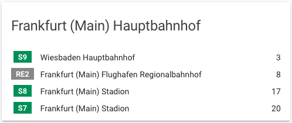

This card generates a simple departure card for the RMV public transport service.

## Options

| Name              | Type    | Requirement  | Description                                 | Default                    |
| ----------------- | ------- | ------------ | ------------------------------------------- | -------------------------- |
| type              | string  | **Required** | `custom:rmv-card`                           |
| entity            | string  | **Required** | Home Assistant entity ID.                   | `none`                     |
| friendly_name     | string  | **Optional** | Card name                                   | Inherited from sensor name |
| hide_title        | boolean | **Optional** | Hide card title                             | `false`                    |
| hide_minutes      | boolean | **Optional** | Hide minutes until departure                | `false`                    |
| show_time         | boolean | **Optional** | Show absolute departure time                | `false`                    |
| convert_minutes   | boolean | **Optional** | Show minutes until departure as hh:mm       | `false`                    |